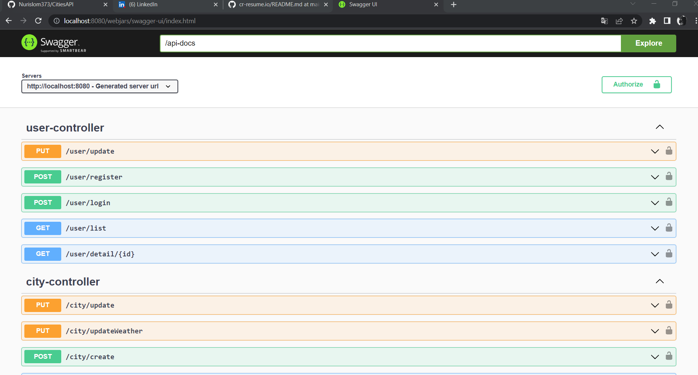
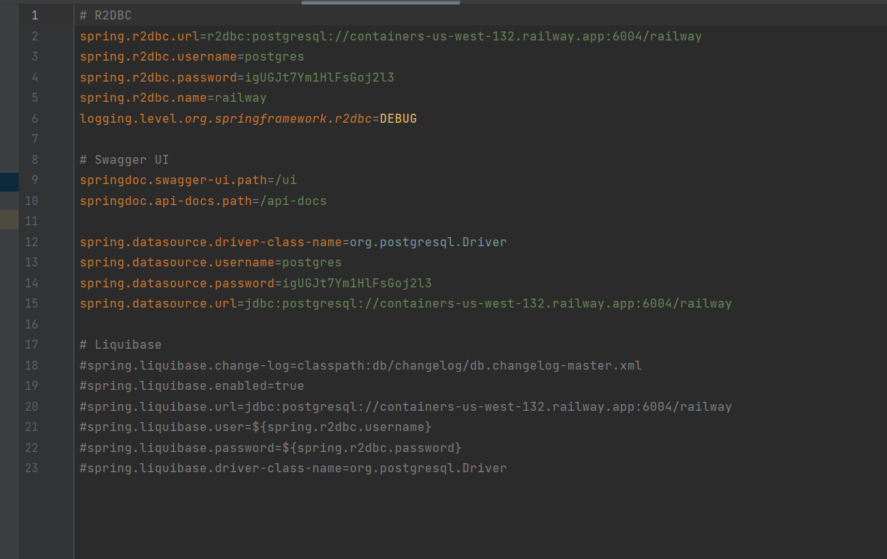

# CitiesAPI

You can test apis with swagger ui: http://localhost:8080/ui

## Liquibase 

I disabled liquibase because it takes an extra 20 seconds to start the program. 
If you want to try Liquibase, you should open a comment!

